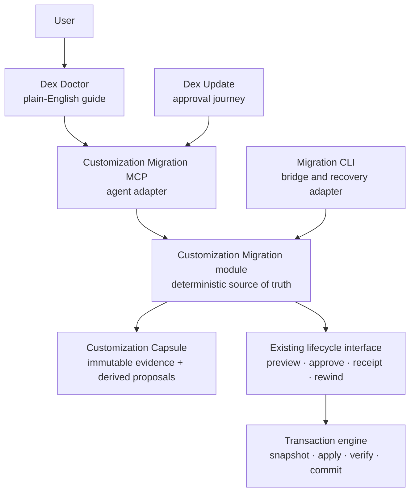
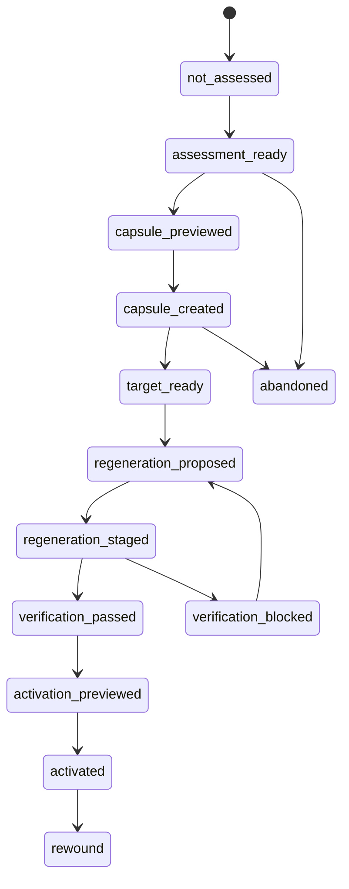

# Customization Migration MCP — implementation plan

**Status:** Proposed plan for Fable review; no implementation authorised by this document

**Date:** 2026-07-24

**Repository:** `dex-core`

**Builds on:** the portable-vault ownership contract, transaction engine, frozen lifecycle
interface, five-group Dex Doctor adoption report, conflict-resolution flow, and brain/vault
split migrator

**Working name:** Customization Migration MCP

---

## The short version

Dex can already protect a user's notes and identify some changed shipped files. That is not
enough for someone who has deeply tailored Dex. Preserving old files without recreating their
connections can leave the user's system technically intact but functionally broken.

Build a deterministic **Customization Migration module** that:

1. rigorously assesses the existing Dex before an upgrade;
2. creates an immutable, content-addressed **Customization Capsule** containing exact evidence,
   dependency relationships, behavioural contracts, and safe-to-read source material;
3. exposes a narrow interface through a local MCP server so Claude can reliably inspect every
   captured customization and propose its new implementation;
4. refuses to proceed until every captured customization has exactly one explicit disposition;
5. stages regenerated customizations away from the live vault;
6. verifies their behaviour against the pre-upgrade contracts;
7. activates only an explicitly approved, hash-bound preview through Dex's existing lifecycle
   transaction engine; and
8. records receipts and supports exact rewind.

Dex Doctor remains the user-facing guide. The MCP server is Claude's controlled doorway. The
deterministic module and existing lifecycle engine remain the source of truth.

The intended product promise is:

> Dex does not merely keep your old custom files. It inventories what you changed, preserves
> the evidence, rebuilds your tailored experience on the new Core, proves what still works,
> and shows you anything it cannot safely carry forward.

---

## 1. Problem

### 1.1 File preservation is not experience preservation

A heavily customised Dex may contain:

- edits to shipped skills;
- entirely new skills;
- personal instructions;
- hooks and background jobs;
- scripts called by skills or hooks;
- custom MCP servers and their trust state;
- custom integrations;
- folder remapping;
- renamed or removed Dex folders;
- changes to templates and configuration;
- hard-coded references to old paths;
- dependencies on executables, packages, applications, permissions, or credentials;
- intentional deletion or disabling of shipped behaviour; and
- local conventions that exist only in prose.

Copying those files into a preserved folder does not make the new Dex use them. A renamed skill
may still call an old script. That script may still assume an old task folder. A hook may point
at the renamed skill. Claude may not know that the preservation folder exists. The user's files
survive while their tailored system quietly stops working.

### 1.2 Current Dex understands byte deltas better than semantic deltas

The current foundation is strong but incomplete:

- The portable-vault contract distinguishes release-owned brain, user-owned vault, seeds,
  generated files, and runtime state.
- Doctor can identify stock-modified and stock-missing catalog files and report them in five
  deterministic groups.
- `/dex-update` can offer Keep mine, Take theirs, Keep both, and Compare for supported
  conflicts.
- `CLAUDE-custom.md` is a special successful seam: the updater deliberately composes it into
  the root `CLAUDE.md` that Claude actually reads.
- The transaction engine provides snapshot-before-write, verification, receipts, crash
  recovery, and rewind.
- The brain/vault migrator can preview the split, preserve the original history, identify
  modified shipped paths, and resume or restore after interruption.

What is missing is a complete model of **what the customization does**, **what it depends on**,
and **how to prove that the equivalent behaviour exists after migration**.

### 1.3 The product risk

Without this layer, Dex can truthfully say “your data was not overwritten” but cannot truthfully
say “your Dex still works the way you shaped it.”

For lightly customised installs, the existing flow may be enough. For deeply customised
installs, it is not an acceptable promise.

---

## 2. Product outcome

### 2.1 User outcome

Before a new Core experience is activated, the user receives a plain-English assessment:

- what is standard Dex;
- what they changed;
- what they added;
- what depends on those changes;
- what Dex can carry forward automatically;
- what Dex can rewrite safely;
- what is now native and no longer needs a customization;
- what needs a temporary compatibility shim;
- what requires review; and
- what could not be proved.

After regeneration, the user sees:

- every customization and its disposition;
- the staged replacement;
- the verification result;
- any unresolved dependency;
- exactly what activation will write;
- the receipt and rewind availability.

No customization disappears merely because Claude omitted it from a response.

### 2.2 Success measures

For a rehearsal set of deeply customised real-shaped vaults:

1. **100% accounting:** every detected customization has exactly one disposition.
2. **Zero unapproved live writes:** no live-vault mutation occurs before an exact preview is
   explicitly approved.
3. **Byte-exact evidence:** every captured non-sensitive source has a verified digest and can
   be recovered from the capsule.
4. **No secret disclosure:** secrets and credential values never enter model-readable capsule
   sections or MCP responses.
5. **Behavioural proof:** every customization marked `verified` has a passing pre-declared
   behavioural contract.
6. **Honest uncertainty:** unprovable intent, missing dependencies, unsafe tests, or ambiguous
   mappings remain blocked or require review.
7. **Exact rewind:** activation can be rewound from the receipt while its snapshot is retained.
8. **Crash convergence:** interruption at every mutation seam produces either the old verified
   state or the fully committed new state, never a mixture.

---

## 3. Fixed architectural decisions

These are recommendations for Fable to challenge explicitly. They should be treated as fixed
for implementation only after review.

### D1 — Doctor is the guide, not the mutation engine

Dex Doctor owns the conversation and renders deterministic authority. It can initiate the
assessment and explain the result, but it does not invent write plans or mutate customization
files.

### D2 — MCP is an adapter, not the source of truth

The MCP protocol is not inherently deterministic. Determinism comes from closed schemas,
canonical serialization, exact-set validation, content hashes, state transitions, approval
tokens, transactions, and receipts.

The MCP server delegates to one deep `core.customization_migration` module. A CLI adapter uses
the same module for bridge installs, recovery, tests, and environments where MCP is not yet
registered.

### D3 — Existing lifecycle machinery owns every live write

Do not build a second updater inside the MCP server. Capsule creation, staging, activation,
retention, and rewind must use or deliberately extend `core.lifecycle.service` and
`core.transaction`.

This requires an explicit operation-specific authority. The current transaction plan correctly
uses `update_write_verdict`, which refuses both runtime state and user-owned vault paths. A
customization migration has two different write classes:

- **protected lifecycle artifacts** — capsule, journal, candidates, verification, and receipts
  under one fixed `System/.dex/customization-migrations/<id>/` root; and
- **approved user extensions** — exact regenerated files written into deliberately enumerated
  customization seams.

Do not weaken `update_write_verdict` or make runtime/vault paths generally writable. Lane A must
design a narrow `customization-migration` authorization profile that:

- can be created only inside the frozen lifecycle implementation after exact approval;
- preserves the universal hard-deny, path, symlink, expected-current-hash, and root-escape
  checks;
- authorises only fixed lifecycle-artifact paths and explicitly enumerated extension seams;
- is rechecked before execution;
- cannot be selected by ordinary update, Doctor repair, onboarding, or MCP arguments; and
- has red-when-removed tests proving those callers still fail closed.

Capsule/staging artifact writes may use a hardened lifecycle-owned artifact writer rather than
pretending they are release updates. Activation of user extensions still uses the transaction
engine's snapshot/apply/verify/receipt flow under the new narrow authority.

### D4 — Evidence and interpretation are separate

Deterministic evidence is immutable. Claude's interpretation and proposed regeneration are
derived, versioned records that point back to the evidence they used.

Claude may say “this appears to add meeting promises to daily planning.” It may not rewrite the
evidence to say that this purpose was proven.

### D5 — Complete accounting is enforced mechanically

Every customization gets a stable `customization_id`. A regeneration plan is accepted only when
its item IDs are an exact set match with the capsule:

- missing ID → refuse;
- duplicate ID → refuse;
- unknown ID → refuse;
- unresolved dependency presented as verified → refuse;
- changed capsule digest → refuse and rebuild the plan.

This does not prove that Claude intellectually understood every byte. It does prove that it
could not silently omit a customization and declare the migration complete.

### D6 — Generated replacements are staged, not made live

Claude writes only into a transaction-owned staging area. Staged files are not invoked by
Claude, hooks, launch agents, or MCP registration until verification and approval complete.

### D7 — Compatibility shims are temporary and explicit

A shim is permitted only where an immediate rewrite cannot be safely proved. Every shim records:

- why it exists;
- what old assumption it preserves;
- its behavioural check;
- its removal condition; and
- an expiry/review release.

No permanent “legacy” dumping ground.

---

## 4. Architecture



### 4.1 Proposed module

Create `core/customization_migration/` as the single implementation locality.

Suggested internal files:

| File | Responsibility |
|---|---|
| `model.py` | Closed dataclasses/enums for assessments, capsule evidence, dispositions, plans, verification, and receipts |
| `schema.py` | Canonical serialization and schema validation |
| `inventory.py` | Release-vs-live customization discovery |
| `references.py` | Dependency and path-reference extraction |
| `sensitivity.py` | Secret/sensitive-content classification and model-readability policy |
| `behaviour.py` | Behavioural-contract models and safe test classification |
| `capsule.py` | Capsule preview, creation, validation, and bounded reads |
| `planning.py` | Exact-set disposition and dependency validation |
| `staging.py` | Candidate validation and isolated staging plan |
| `verification.py` | Static, fixture, read-only-live, and manual verification runners |
| `state.py` | Migration state projection from append-only evidence |
| `service.py` | The small external interface used by MCP and CLI adapters |
| `report.py` | Deterministic authority plus human-readable rendering inputs |

Internal seams may use language-specific adapters for Python, CommonJS, shell, Markdown, YAML,
JSON, and Claude skill frontmatter. Those adapters remain private to the module.

### 4.2 External interface

The module should expose a small operation set:

```python
assess(vault_root, target_release) -> Assessment
preview_capsule(assessment) -> CapsulePreview
create_capsule(preview, approval_token) -> CapsuleReceipt
read_capsule(capsule_id, section, cursor=None) -> CapsulePage
preview_regeneration(capsule_id, candidate) -> RegenerationPreview
stage_regeneration(preview, approval_token) -> StagingReceipt
verify_staging(staging_receipt) -> VerificationReport
preview_activation(staging_receipt) -> ActivationPreview
activate(preview, approval_token) -> ActivationReceipt
rewind(activation_receipt, acknowledgement_token) -> RewindReceipt
read_status(capsule_id) -> MigrationStatus
```

Names can change during implementation, but the interface should retain these properties:

- reads return data and make no incidental writes;
- every mutation has a separate preview and approval token;
- responses use closed schemas;
- all paths are vault-relative canonical paths;
- every result declares `OK`, `OFF`, `BROKEN`, or `UNKNOWN` where evidence can degrade;
- evidence drift invalidates the next mutation;
- ordinary update authority cannot be substituted for customization-migration authority;
- the interface never accepts arbitrary shell commands.

---

## 5. The Customization Capsule

### 5.1 Storage

Recommended location:

```text
System/.dex/customization-migrations/<capsule-id>/
```

This location is:

- local runtime state, not release content;
- excluded from upstream releases and vault remotes;
- available before and after the brain replacement;
- protected by restrictive permissions;
- visible to Doctor through the deterministic module; and
- outside ordinary Claude discovery, so access is always explicit.

Do not silently include capsules in off-device backups. Do not prune a capsule while it is the
only recovery or provenance record for an active migration.

### 5.2 Directory shape

```text
<capsule-id>/
├── manifest.json
├── journal.jsonl
├── evidence/
│   ├── customizations.json
│   ├── dependencies.json
│   ├── behaviours.json
│   ├── exclusions.json
│   └── environment.json
├── blobs/
│   └── <sha256>
├── restricted/
│   └── <opaque-id>
├── interpretations/
│   └── <proposal-id>.json
├── candidates/
│   └── <proposal-id>/
├── verification/
│   └── <staging-id>.json
├── receipts/
│   ├── capsule.json
│   ├── staging.json
│   ├── activation.json
│   └── rewind.json
└── report.md
```

`blobs/` contains exact non-sensitive source bytes addressed by SHA-256. `restricted/` contains
only material whose local preservation is necessary but which is not model-readable. It is
mode `0600` under a mode `0700` capsule and is accessed only through narrowly authorised
recovery operations.

### 5.3 Manifest

The canonical manifest should include:

- schema version;
- capsule ID;
- source release identity;
- target release identity;
- vault identity/fingerprint without personal content;
- creation time;
- inventory digest;
- evidence digest;
- customization count;
- dependency count;
- behavioural-contract count;
- restricted-item count;
- excluded scope with reasons;
- completeness verdict;
- required module/interface version;
- all section digests and byte sizes.

The capsule ID should be derived from canonical manifest inputs and collision-safe entropy. The
manifest must not include its own final digest.

### 5.4 Customization record

Every detected customization receives one record:

```json
{
  "customization_id": "cust-...",
  "kind": "modified-skill",
  "source_paths": [".claude/skills/daily-plan/SKILL.md"],
  "baseline": {
    "release_version": "1.70.0",
    "sha256": "..."
  },
  "live": {
    "sha256": "...",
    "byte_size": 1234,
    "model_readability": "readable"
  },
  "evidence": {
    "change_type": "stock-modified",
    "references": ["dep-..."],
    "behaviour_contracts": ["beh-..."]
  },
  "required_disposition": true
}
```

The evidence layer does not contain a free-form claim about intent unless that intent is quoted
from an explicit user-authored description. Claude's inferred purpose lives in an
interpretation record with confidence and evidence references.

### 5.5 Dependency graph

The assessor should capture, where safely provable:

- instruction → skill references;
- skill → script references;
- hook → command/script references;
- MCP registration → server path and interpreter;
- script → local module/import references;
- configuration → folder names and feature flags;
- launch agent → executable and working directory;
- Markdown links and literal old-path references;
- executable/package/application dependencies;
- permission prerequisites;
- environment-variable names, never values;
- trust-registry references;
- renamed and deleted target paths; and
- embedded repositories and symlinks.

Each relationship records its evidence source, extractor, confidence class, and whether it was
statically proved or heuristically inferred.

### 5.6 Behavioural contracts

Behavioural contracts describe what must remain true, not exact old implementation details.

Examples:

- “When daily planning runs, unresolved meeting promises appear in the generated plan.”
- “This skill is triggered by the phrases X, Y, and Z.”
- “This script reads tasks through the configured task folder rather than a hard-coded path.”
- “This MCP tool lists data but cannot send or delete.”
- “This hook may update generated indexes but must not alter hand-written prose.”

Verification classes:

| Class | Meaning |
|---|---|
| `static` | Validate structure, references, schemas, permissions, and imports without execution |
| `isolated-fixture` | Execute against a synthetic vault with fake credentials and no network |
| `read-only-live` | Exercise a proven read-only path against the user's environment after explicit consent |
| `manual` | Requires user observation or an external action that cannot be automated safely |
| `unsafe-unverified` | Cannot currently be exercised without unacceptable side effects |

No migration may convert `manual` or `unsafe-unverified` into `verified` merely because the
generated code looks plausible.

---

## 6. Deterministic assessment

### 6.1 Scope

Assessment must compare a live vault against a verified installed-release baseline. If the
release identity is unavailable or ambiguous, the affected evidence is `UNKNOWN`; it is not
treated as customization-free.

Inspect:

1. root instructions and extension markers;
2. shipped and custom skills;
3. hooks and Claude settings;
4. scripts and executable modes;
5. MCP configuration and server sources;
6. trusted custom-MCP registry state;
7. folder remapping and custom top-level paths;
8. templates and user configuration;
9. launch agents/background jobs owned by Dex;
10. Obsidian settings relevant to Dex behaviour;
11. installed capability rooms;
12. deleted shipped files;
13. unclassified paths;
14. embedded repositories and symlinks;
15. runtime/package/application dependencies; and
16. references to paths that change in the target Core.

### 6.2 Discovery adapters

Use deterministic parsers where available:

- JSON/YAML parsers for structured configuration;
- Markdown/frontmatter parsing for skills;
- Python AST for Python imports and literal file references;
- a JavaScript parser or conservative static extraction for CommonJS/Node;
- plist parsing for launch agents;
- shell tokenization for simple static command/path references;
- exact byte search for target-release path mappings.

Heuristic extraction must never be promoted to proof. It produces an explicit
`inferred-reference` requiring either confirmation or verification.

### 6.3 Assessment output groups

Extend Doctor's current five-group register without changing its authority:

1. **Already portable** — customizations already living in supported seams.
2. **Can be regenerated** — sufficient evidence and a supported target seam exist.
3. **Needs interpretation** — purpose or mapping is not yet provable.
4. **Blocked** — missing baseline, unsafe content, unavailable dependency, or unsupported
   target.
5. **No longer needed** — candidate for retirement because equivalent native behaviour exists;
   this remains a proposal until approved.

These are customization-migration groups inside the larger Doctor adoption surface, not a
replacement for the existing adoption groups.

---

## 7. MCP adapter

### 7.1 Server properties

Create `core/mcp/customization_migration_server.py`:

- local stdio only;
- no listening socket;
- no network client;
- one verified vault root from launch configuration;
- closed JSON schemas for every tool;
- no arbitrary filesystem paths from the model;
- no arbitrary command execution;
- bounded reads and paginated responses;
- structured errors with `OK/OFF/BROKEN/UNKNOWN`;
- audit-safe logging with no source bytes or secret values;
- calls only `core.customization_migration.service`;
- direct tests of tool listing, malformed arguments, unknown tools, and subprocess startup.

### 7.2 Tool surface

Recommended tools:

| Tool | Effect |
|---|---|
| `assess_customizations` | Read-only assessment against a verified source and target release |
| `preview_customization_capsule` | Read-only exact capsule preview and approval token |
| `create_approved_customization_capsule` | Writes only the approved protected capsule |
| `read_customization_capsule` | Paginated, digest-bearing read of one capsule section |
| `preview_regeneration_plan` | Validates exact-set dispositions and candidate files; no live write |
| `stage_approved_regeneration` | Writes only to the protected staging area |
| `verify_staged_regeneration` | Runs the allowed verification classes and returns authority |
| `preview_customization_activation` | Exact live write set and approval token |
| `activate_approved_customizations` | Executes through the lifecycle transaction engine |
| `read_customization_migration_status` | Read-only projected state and recovery guidance |
| `rewind_customization_activation` | Receipt-bound exact rewind |

This is a small interface relative to the implementation. Internal scripts are not individually
exposed as tools.

### 7.3 Reliable complete reading

`read_customization_capsule` responses include:

- capsule ID;
- evidence digest;
- section ID;
- section digest;
- record count;
- current page;
- next cursor;
- returned record IDs; and
- completeness flag.

The server does not rely on Claude remembering which pages it read. The submitted regeneration
plan must reference the capsule's current evidence digest and provide exactly one disposition
for every customization ID.

### 7.4 Registration and the bridge problem

An old Dex cannot depend on an MCP server that arrives only after its brain is replaced.

Therefore:

1. a compatibility bridge release ships the deterministic module, MCP adapter, CLI adapter,
   schemas, and Doctor probe before the new Core is offered;
2. the pre-upgrade capsule can be created through the CLI/lifecycle adapter even if MCP is not
   registered;
3. Doctor may offer to add the Dex-owned MCP registration through the existing additive,
   explicit-consent path without deleting user-added servers;
4. the capsule remains under `System/.dex/` across brain replacement;
5. after the new Core starts, its generated instructions and Doctor status explicitly direct
   Claude to the pending capsule through the MCP tools; and
6. the server re-verifies the capsule before allowing regeneration to continue.

Do not make `.mcp.json` replacement a migration requirement. It remains user-owned.

---

## 8. Regeneration planning

### 8.1 Canonical dispositions

Every customization must receive exactly one:

| Disposition | Meaning |
|---|---|
| `carry-forward` | Existing implementation already lives in a supported seam and remains compatible |
| `rewrite` | Recreate the behaviour using the new Core and supported extension seams |
| `compatibility-shim` | Temporarily preserve an old interface with a documented removal condition |
| `native-replacement` | New Core already provides the behaviour; retire only after equivalence is verified and approved |
| `keep-disabled` | Preserve the user's intentional deletion/disablement |
| `manual-review` | Human decision or safe manual verification required |
| `blocked` | Missing evidence, unsafe content, unavailable dependency, or unsupported target |

`ignored`, `probably fine`, and omitted are not valid dispositions.

### 8.2 Target seams

Prefer:

- `CLAUDE-custom.md` for personal instructions that must be composed into root instructions;
- the contract-approved custom skill namespace for user skills;
- `core/mcp-custom/` for custom MCP implementations;
- user-owned configuration files for values and feature choices;
- declarative hooks/launch-agent templates where supported;
- folder-path abstractions rather than hard-coded PARA paths; and
- explicit capability rooms rather than recreating absent folders.

Do not patch release-owned `core/`, shipped skill, hook, or agent files as the regenerated
solution. If no supported seam exists, the item is blocked and the plan should propose a
product seam rather than silently recreating an in-place patch.

### 8.3 Candidate submission

Claude produces a candidate containing:

- capsule ID and evidence digest;
- complete disposition set;
- evidence references for each intent claim;
- proposed target paths;
- full candidate bytes and digests;
- dependency remapping;
- behavioural-contract mapping;
- declared new permissions or trust requirements;
- confidence;
- unresolved questions; and
- shim expiry data where applicable.

The deterministic module validates shape, paths, ownership, exact-set coverage, dependency
closure, source hashes, and target collisions. It does not treat Claude's confidence as proof.

---

## 9. Staging and verification

### 9.1 Staging area

Recommended location:

```text
System/.dex/customization-migrations/<capsule-id>/candidates/<proposal-id>/staging/
```

Properties:

- mode `0700`, files `0600` until activation determines final modes;
- no symlinks;
- no path traversal;
- no hooks or executable registration;
- no live MCP registration;
- exact candidate digest;
- lifecycle-owned artifact creation under the one fixed capsule root;
- safe removal only after a retained activation receipt or explicit abandonment.

### 9.2 Verification ladder

Run in order:

1. schema and canonical-path validation;
2. ownership-contract authorization for eventual target paths;
3. content and mode digest verification;
4. missing-reference and dependency-closure checks;
5. import/syntax checks;
6. target-release compatibility checks;
7. static trust and permission delta;
8. isolated-fixture behavioural checks;
9. explicitly approved read-only live checks;
10. manual checks.

Any failed required check blocks activation. `UNKNOWN` remains visible and blocks any claim of
verified equivalence.

### 9.3 Behaviour comparison

Where safe, capture a before/after receipt:

- same input fixture;
- old customization output;
- regenerated customization output;
- normalized comparison rules;
- protected invariants, including files that must remain byte-identical;
- differences and their approval status.

Do not execute old or regenerated workflows against real external systems merely to compare
them. Sending messages, modifying calendars, deleting records, spending money, or touching
credentials always requires an explicit separate user action and may remain manual.

---

## 10. Activation, receipts, and rewind

### 10.1 Activation preview

The user sees:

- capsule/source release;
- target release;
- every customization and disposition;
- every live path written;
- every old path retained or retired;
- every new permission/trust request;
- verification verdict per behavioural contract;
- blocked/manual items;
- exact approval token;
- snapshot retention and rewind status.

Activation is refused unless:

- capsule validation is `OK`;
- complete accounting passes;
- required verification passes;
- no blocked item is represented as complete;
- source and target evidence still match;
- target paths remain contract-authorised;
- no concurrent lifecycle transaction is active; and
- the explicit approval token matches the unchanged preview.

### 10.2 Transaction

Route the complete approved set through one lifecycle transaction where practical. If size or
platform limits require multiple transactions, the plan must define an enclosing migration
state that can unwind all committed sub-transactions in reverse order.

The transaction must use the sealed customization-migration authorization profile described in
D3. Ordinary `update_write_verdict` remains unchanged and remains the only authority available
to ordinary updates. The new profile is not a user-selectable string and is never accepted from
MCP input.

Never allow a half-activated dependency chain.

### 10.3 Receipt

The activation receipt binds:

- capsule ID and evidence digest;
- target release identity;
- regeneration proposal digest;
- verification report digest;
- every disposition;
- every written path and resulting hash/mode;
- transaction ID;
- snapshot reference;
- activation time;
- lifecycle ledger event; and
- rewind acknowledgement availability.

### 10.4 Rewind

Rewind uses the exact receipt and existing acknowledgement discipline. It restores the
pre-activation state; it does not pretend to reverse external actions taken during manual
verification.

Doctor must distinguish:

- `rewindable: true`;
- clean snapshot pruning;
- invalid or missing evidence (`UNKNOWN`);
- drift that prevents safe rewind; and
- a completed rewind.

---

## 11. Privacy, secrets, and trust

### 11.1 No secret values in model-readable evidence

The assessor may record:

- environment-variable names;
- credential-provider names;
- Keychain item labels where existing policy permits;
- whether a credential reference is present;
- opaque secret-finding IDs; and
- whether remediation is required.

It must not return raw values, tokens, cookies, private keys, `.env` contents, or credential
file bodies through MCP.

### 11.2 Embedded-secret handling

If a custom script appears to contain an embedded secret:

1. classify it as restricted;
2. preserve exact bytes only in the restricted local archive if safe policy permits;
3. provide Claude a redacted structural view;
4. block activation until the secret is moved into the approved credential mechanism or the
   user explicitly resolves the finding;
5. never derive a value-based identifier that could help recover the secret; and
6. never run the script as a migration test.

### 11.3 Custom MCP trust

Preserve the current trust model:

- recurring trust is user-owned;
- trust binds exact path and bytes;
- a regenerated MCP is new code and requires a new trust decision;
- old trust does not automatically transfer to rewritten bytes;
- one-off startup proof and recurring execution consent remain separate;
- model wording must not oversell isolation.

### 11.4 Filesystem safety

All capsule, staging, and activation operations must:

- bind one resolved vault root;
- reject symlinked roots, parents, and targets where current contracts require;
- reject traversal and absolute paths;
- use bounded reads;
- use atomic writes and directory fsync;
- use restrictive modes;
- share the lifecycle single-writer lock;
- re-read and re-hash before mutation; and
- fail closed on unclassified ownership;
- distinguish lifecycle-artifact authority from live-extension authority; and
- prove ordinary update callers cannot acquire customization-migration authority.

---

## 12. Doctor and update experience

### 12.1 Doctor

Add a deterministic customization-migration section:

- assessment status;
- capsule status;
- total customization count;
- accounted/unaccounted counts;
- blocked/manual counts;
- staging verification;
- pending approval;
- activation/rewind status;
- exact recovery action when interrupted.

Doctor does not paraphrase authority fields. It may explain their consequence in plain English.

Example:

> I found 14 customizations. Nine can be recreated on the new Core, two are now built in,
> two need review, and one custom connection cannot be verified without your approval. Nothing
> has changed yet.

### 12.2 Dex Update

`/dex-update` gains a deep-customization branch:

1. inspect;
2. explain the scope and privacy posture;
3. preview and create the capsule;
4. update/convert the Core only after the capsule receipt exists;
5. resume regeneration from the capsule;
6. present unresolved questions one at a time;
7. stage and verify;
8. show activation preview;
9. require exact approval;
10. activate and show receipt.

The normal lightweight path remains concise for installs with no meaningful customizations.

### 12.3 Session continuity

The generated root instructions should contain only a small invariant:

> If Doctor reports a pending customization migration, use the registered Customization
> Migration MCP to read its status and continue through its returned next action. Do not search
> for or edit capsule files directly.

The capsule path itself is not hard-coded into instructions. The deterministic status lookup
finds the active capsule.

---

## 13. State machine

Canonical states:

```text
not-assessed
assessment-ready
capsule-previewed
capsule-created
target-ready
regeneration-proposed
regeneration-staged
verification-passed
verification-blocked
activation-previewed
activated
rewound
abandoned
recovery-required
unknown
```

Allowed forward path:



Any corrupt or contradictory state projects to `UNKNOWN` or `recovery-required`; it is never
silently reset to an empty migration.

State is projected from append-only journal and receipt evidence. A convenience cache is
rebuildable and never authoritative.

---

## 14. Implementation lanes

### Lane A — Contracts and threat model

**Goal:** freeze the semantics before code gains write capability.

Deliver:

- customization and disposition vocabulary;
- capsule JSON schemas;
- MCP operation schemas;
- state-machine contract;
- sensitivity policy;
- threat model;
- sealed customization-migration write-authority contract;
- proof that ordinary updates cannot invoke that authority;
- size/count limits;
- canonical serialization;
- red-when-removed contract tests.

No live writes in this lane.

### Lane B — Read-only assessment

**Goal:** complete, honest release-vs-live inventory.

Deliver:

- inventory module;
- deterministic extractors;
- dependency graph;
- sensitivity classification;
- assessment report;
- fixture corpus representing light, medium, and extreme customization;
- `UNKNOWN` behaviour for missing/ambiguous baseline;
- performance budget.

Doctor can render the result, but capsule creation remains unavailable.

### Lane C — Capsule preview and creation

**Goal:** immutable evidence survives the Core replacement.

Deliver:

- capsule preview;
- restrictive local storage;
- content-addressed blobs;
- restricted-item handling;
- append-only journal;
- canonical validation;
- capsule receipt;
- fault injection;
- idempotent resume and exact abandonment semantics.

### Lane D — MCP and CLI adapters

**Goal:** Claude and the bridge invoke the same deterministic interface.

Deliver:

- local MCP server;
- CLI adapter;
- bounded/paginated capsule reads;
- exact-set coverage validator;
- MCP registration through the existing additive consent path;
- startup and malformed-request tests;
- no-network/no-arbitrary-command assertions.

### Lane E — Regeneration planning and staging

**Goal:** accept intelligent proposals without granting live-write authority.

Deliver:

- interpretation/proposal schema;
- canonical dispositions;
- target-seam validation;
- dependency-closure validation;
- candidate collision handling;
- transaction-owned staging;
- staging receipt;
- compatibility-shim policy.

### Lane F — Verification engine

**Goal:** prove behaviour to the strongest safe level.

Deliver:

- static verification;
- isolated fixture runner;
- read-only-live consent boundary;
- manual verification records;
- old-vs-new output comparison;
- prose/data byte-preservation assertions;
- blocked/unknown propagation;
- verification receipt.

### Lane G — Activation and rewind

**Goal:** make the verified tailoring live through the one safe engine.

Deliver:

- activation preview;
- approval token;
- lifecycle transaction integration;
- activation receipt;
- rewind;
- concurrent-writer refusal;
- snapshot retention reporting;
- kill-point recovery suite.

### Lane H — Doctor and update journey

**Goal:** make the machinery understandable without exposing internals.

Deliver:

- Doctor section;
- `/dex-update` migration branch;
- one-question-at-a-time review for blocked items;
- session-continuity instruction;
- interrupted-migration guidance;
- plain-English final report.

### Lane I — Rehearsal and rollout

**Goal:** prove it on reality before making the promise.

Deliver:

- synthetic hostile fixture suite;
- copies of at least two real-shaped customised vaults;
- one copy of a genuinely heavily customised vault with explicit authorisation;
- before/after workflow scorecard;
- forced interruption at every write phase;
- restore rehearsal;
- release-candidate report;
- independent adversarial security review;
- explicit ship/no-ship decision.

---

## 15. Recommended PR sequence

| PR | Scope | Writes live user files? | Depends on |
|---|---|---:|---|
| 1 | Lane A: contracts, schemas, threat model | No | — |
| 2 | Lane B: read-only assessment | No | 1 |
| 3 | Lane C: capsule preview/create | Protected capsule only | 1–2 |
| 4 | Lane D: MCP + CLI adapters | Registration only with consent | 1–3 |
| 5 | Lane E: proposal validation + staging | Staging only | 1–4 |
| 6 | Lane F: verification | Only declared safe fixtures/read-only probes | 1–5 |
| 7 | Lane G: activation + rewind | **Yes** | 1–6 |
| 8 | Lane H: Doctor/update journey | Through frozen interfaces only | 1–7 |
| — | Lane I: rehearsal and release gate | Vault copies only until ship decision | 1–8 |

Every write-capable PR receives:

- independent adversarial review;
- final-diff review;
- focused tests;
- full relevant gates;
- mutation-boundary fault injection;
- confirmation that no parallel write path was introduced.

---

## 16. Test strategy

### 16.1 Unit tests

- canonical serialization;
- schema closure;
- stable IDs;
- baseline classification;
- parser/extractor behaviour;
- exact-set dispositions;
- dependency closure;
- sensitivity policy;
- state transitions;
- approval-token binding;
- path and symlink refusal;
- bounded reads;
- pagination and section digests.

### 16.2 Contract tests

- lifecycle interface change is deliberate and versioned/bridged correctly;
- customization-migration authority is sealed inside lifecycle implementation and cannot be
  selected by ordinary update/MCP arguments;
- MCP schemas match module requests/responses;
- CLI and MCP adapters produce identical canonical results;
- all shipped paths remain classified;
- generated architecture inventory remains current;
- distribution includes the server/module/schemas and excludes capsule data.

### 16.3 Journey tests

1. no customizations → lightweight path;
2. `CLAUDE-custom.md` only → compose and verify;
3. one modified shipped skill → rewrite/keep/native options;
4. custom skill calling a custom script with remapped folders;
5. custom MCP with explicit trust and environment-variable references;
6. edited hook plus background job;
7. intentionally deleted shipped feature;
8. embedded secret in a script → restricted and blocked;
9. missing baseline → `UNKNOWN`, no migration;
10. target path collision → refuse;
11. incomplete Claude plan → exact-set refusal;
12. capsule drift between read and plan → refuse;
13. target drift between preview and activation → refuse;
14. crash during capsule creation;
15. crash during staging;
16. crash during activation;
17. rewind after activation;
18. pruned snapshot → honest non-rewindable state;
19. capsule tampering → validation failure;
20. migration resumed after the Core brain is replaced.

### 16.4 Security tests

- path traversal;
- root escape;
- symlink swap;
- oversized file/capsule/page;
- malformed UTF-8 and binary sources;
- secret-value leakage in output/log/report;
- arbitrary command injection;
- MCP argument confusion;
- stale approval token;
- replay against another vault;
- trust carry-over to changed MCP bytes;
- concurrent transaction;
- journal corruption and torn tail;
- malicious capsule metadata;
- model attempt to mark missing items complete.

### 16.5 Outcome-level rehearsal

The release gate is not “tests pass.” On a copy of a deeply customised vault:

- enumerate the actual custom workflows with the owner;
- capture the capsule;
- independently inspect the assessment;
- upgrade the Core;
- regenerate;
- run each safe workflow;
- manually check the remainder;
- compare the user's important outputs;
- confirm personal notes and prose are byte-identical where migration did not declare a write;
- interrupt and resume;
- rewind;
- inspect the final Doctor report as a non-technical user would.

---

## 17. Performance and limits

Initial recommended limits:

- bounded individual reads;
- explicit handling for binary files;
- capsule byte and file-count report before creation;
- streaming/hash-by-chunk rather than whole-vault reads;
- incremental extraction cache keyed by source hash;
- Doctor quick mode reports status without rebuilding the assessment;
- deep assessment is explicit and progress-reporting;
- no unbounded MCP response;
- no implicit traversal of dependency caches, `node_modules`, Git object databases, archives,
  or embedded repositories.

Do not silently truncate. When a limit is hit, record exact uninspected scope and return
`UNKNOWN` for completeness.

---

## 18. Failure and recovery rules

- Failure before capsule receipt: no claim that evidence is preserved.
- Failure after capsule receipt but before Core update: safe to resume or abandon.
- Failure after Core update but before regeneration: new Core stays live; Doctor points to the
  capsule and resumes.
- Failure during staging: live vault unchanged; discard or resume the staging transaction.
- Verification failure: live vault unchanged.
- Failure during activation: transaction recovery restores the previous live state.
- Failure after activation receipt: migration is complete; optional rewind follows the receipt.
- Invalid capsule or journal: preserve evidence, return `UNKNOWN`, do not rebuild destructively.
- Missing only authoritative capsule: stop and provide recovery guidance; never infer an empty
  customization set.

---

## 19. Documentation and observability

Update:

- `docs/dex-doctor-spec.md`;
- `docs/portable-vault-contract-design.md` where ownership rules change;
- lifecycle interface schema and design docs;
- `docs/architecture/INVENTORY.md` through its generator;
- `DEX-CORE-MAP.md`;
- `.claude/skills/dex-doctor/SKILL.md`;
- `.claude/skills/dex-update/SKILL.md`;
- setup/onboarding documentation for MCP registration;
- release notes only after rehearsal and ship approval.

Telemetry, if opted in, may include only anonymous counts and verdicts:

- assessment attempted/completed;
- customization count bands;
- disposition counts;
- verification verdict counts;
- activation/rewind success;
- module/interface version.

Never include paths, filenames, source text, intent summaries, dependency names, provider names,
or capsule identifiers.

---

## 20. Non-goals for the first release

- Automatically improving the user's customizations beyond compatibility.
- Running write-capable workflows against real external systems for verification.
- Uploading capsules for cloud analysis.
- Sharing capsules between users.
- Treating model confidence as verification.
- Migrating arbitrary software outside the Dex vault.
- Supporting every programming language through deep semantic analysis.
- Automatically deleting old customizations or compatibility shims.
- Automatically granting trust to regenerated MCP code.
- Guaranteeing equivalent behaviour where the old system itself cannot be executed or
  understood safely.

---

## 21. Ship gates

Do not offer this as “your tailored Dex will carry forward” until all are true:

1. contracts and threat model independently approved;
2. complete-accounting red-when-removed test passes;
3. capsule survives a brain replacement and remains readable;
4. secret-leak test suite passes;
5. MCP and CLI parity passes;
6. no alternate live-write route exists and ordinary updates cannot acquire customization
   authority;
7. activation and rewind fault-injection suites pass;
8. two independent adversarial reviews return no unresolved high-severity findings;
9. the real-vault rehearsal passes;
10. Doctor's report is understandable without implementation vocabulary;
11. unsupported/unknown customizations visibly block the promise; and
12. Dave gives the explicit ship decision.

Before those gates pass, describe the feature as an experimental guided migration and retain the
existing conservative preservation language.

---

## 22. Decisions for Fable's review

Fable should explicitly accept, revise, or reject:

1. **Module seam:** one deterministic `core.customization_migration` module with MCP and CLI
   adapters.
2. **Capsule storage:** local protected `System/.dex/customization-migrations/<id>/`.
3. **Evidence split:** immutable deterministic evidence versus versioned Claude
   interpretations.
4. **Coverage rule:** exact-set disposition for every customization ID.
5. **MCP surface:** narrow tools, no arbitrary command execution, no network.
6. **Registration bridge:** module/CLI available before MCP registration; `.mcp.json` remains
   user-owned.
7. **Target policy:** generated tailoring must use supported custom seams, never repatch
   release-owned Core.
8. **Verification classes:** static, isolated fixture, explicit read-only live, manual, and
   unsafe-unverified.
9. **Activation rule:** verified staging plus exact approval through the lifecycle transaction
   engine.
10. **Rollout bar:** no strong user promise before a deeply customised real-vault rehearsal.

Recommended default: accept all ten and let implementation research refine schemas, limits, and
extractor coverage without weakening the trust contract.

---

## 23. First implementation task after approval

Do not start with the MCP server.

Start with a read-only vertical slice:

1. define the capsule and customization schemas;
2. compare one verified release against one synthetic customised vault;
3. detect three linked changes: modified skill → custom script → remapped folder;
4. emit stable IDs, dependency evidence, and completeness verdict;
5. prove an omitted item makes exact-set plan validation fail;
6. render the result through Doctor;
7. run independent adversarial review.

Only after that slice proves the evidence model should the project add capsule writes, MCP
tools, model-generated candidates, or activation.
